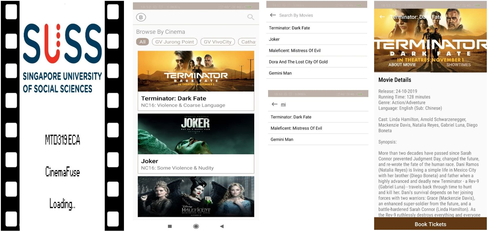
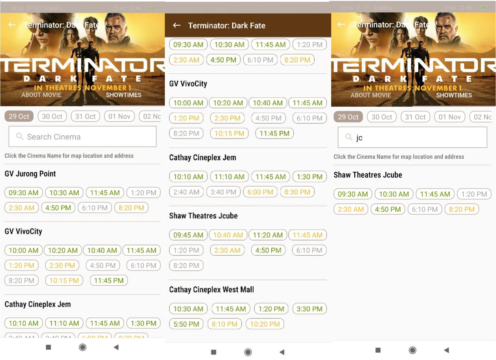
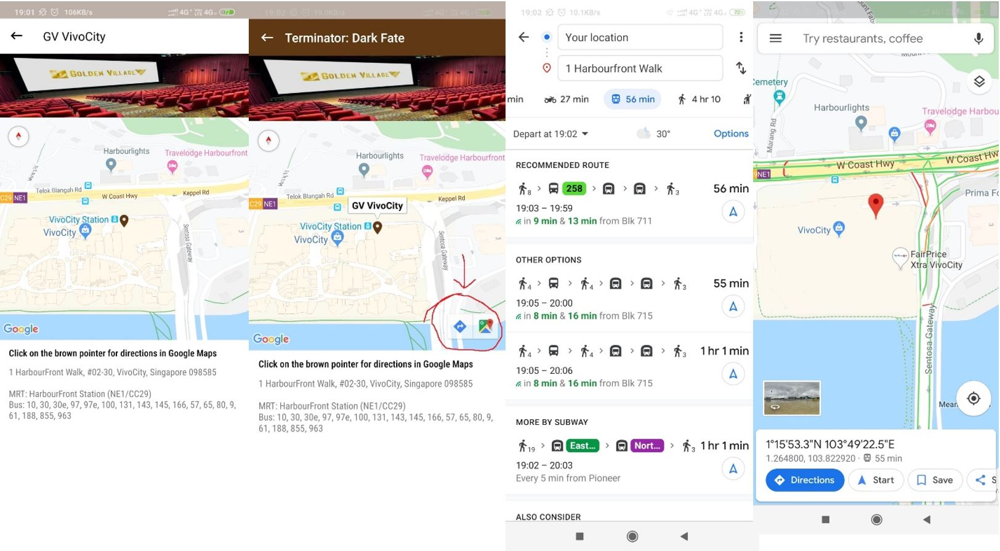
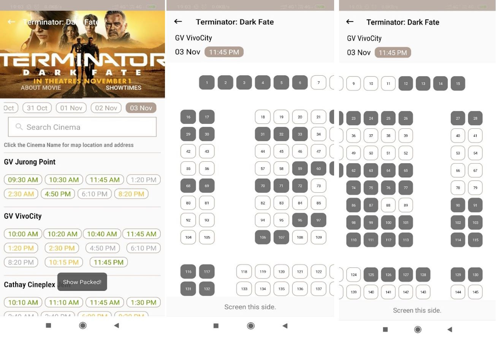

# CinemaFuse
The objective of CinemaFuse, a third-party movie booking application, is to integrate movie ticket bookings from various cinema chains in Singapore. It is a concept app that enables users to browse and reserve movie tickets for any theater within a single app. Along with the date and time of the movie screenings, it also displays information about the movie. By integrating Google Maps, CinemaFuse can also provide the address and directions to a specific movie theater.
 

